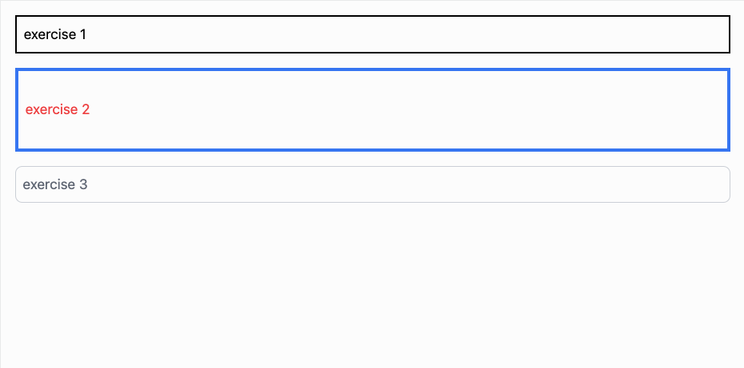
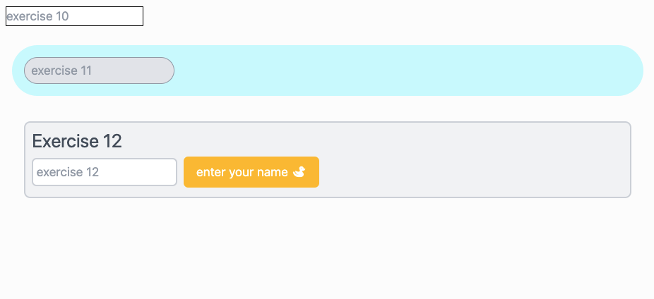

# Style Exercises

Let's practice styling some elements using what we've learned so far! In the follow exercises, we'll
practice using magin, padding, and colors. We'll also learn how to use icons, buttons, and inputs.

Since we are new to coding and this is one of our first exercises, you'll be coding along with us!
This means you should watch a few minutes of the video, then pause it after we write a few lines of
code so you can write the same lines of code. Make sure that you are running your code often to see
if it is displaying as intended. Feel free to call over a teaching assistant if you need help!

## Starter code

There are four sections split into three exercises each. You should create a new HTML/CSS
[replit](https://replit.com/~) when beginning a new section. Use the following starter code for
every replit you create:

```html
<!DOCTYPE html>
<html>
  <head>
    <meta charset="utf-8" />
    <meta name="viewport" content="width=device-width, initial-scale=1.0" />
    <script src="https://cdn.tailwindcss.com"></script>
    <script src="https://kit.fontawesome.com/638d441c12.js" crossorigin="anonymous"></script>
    <script></script>
  </head>
  <body>
    your exercise code goes here!
  </body>
</html>
```

The starter code above, includes some configration so you can use the icons and styles needed in the
exercises.

## Exercises 1-3

In this section we'll start simple. We'll create three `div`s, playing with their margin, padding,
border, and color properties:



Code along with us in this video walkthrough:

- [🎥 Style Exercises 1-3 Walkthrough]()

## Exercises 4-6

In this section we'll introduce buttons! We'll create three `buttons`s and apply some different
styles to them to make them appear like something that the user would want to click! We'll also
explore how we can easily apply hover effects to buttons:


Code along with us in this video walkthrough:

- [🎥 Style Exercises 4-6 Walkthrough]()

## Exercises 7-9

Let's continue to experiment with some button styles but now include some icons using the `i`
element! Learning how style icons is important because we can use icons to express ideas without
using words! We'll use [fontawesome](https://fontawesome.com/) to get our icons. We'll work on some
icon buttons that look like this:


Code along with us in this video walkthrough:

- [🎥 Style Exercises 7-9 Walkthrough]()

## Exercises 10-12

In these final exercises we'll start to use `input`s to give the user places where they can enter
some text. We'll build a few `input`s and tie in other patterns from the previous exercises:



Code along with us in this video walkthrough:

- [🎥 Style Exercises 10-12 Walkthrough]()
