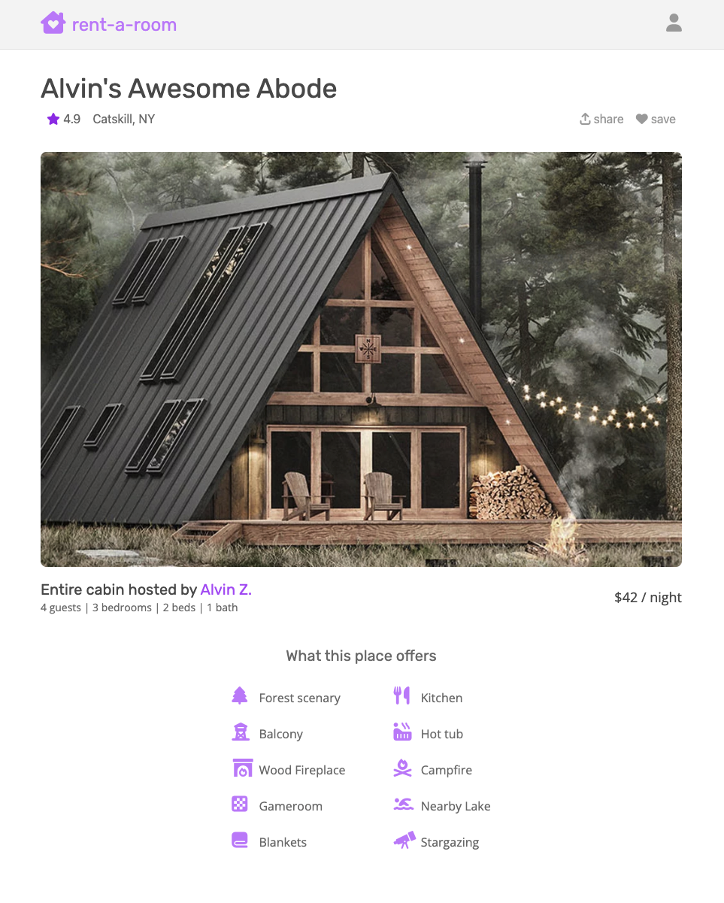

# Rent-a-room Project

In this project, we'll create a layout for displaying information about a place that someone can
rent out. The layout will be somewhat inspired by [airbnb](https://www.airbnb.com/). The final
product for our page looks like this:



Create a identical layout! You may change only the image, colors, text, and icons.

You've already used all the tools you need to create this design.  We want **you** to drive this. For
this project, try to code this one up and only use the video walkthrough if you get stuck!

Choose your own colors from [tailwindcss](https://tailwindcss.com/docs/customizing-colors) and icons
from [font-awesome](https://fontawesome.com/).

## Starter code

Use this starter code. We've given you two fonts, `font-rubik` and `font-open`.

```html
<!DOCTYPE html>
<html>
  <head>
    <meta charset="utf-8" />
    <meta name="viewport" content="width=device-width, initial-scale=1.0" />
    <script src="https://cdn.tailwindcss.com"></script>
    <script src="https://kit.fontawesome.com/638d441c12.js" crossorigin="anonymous"></script>
    <link rel="preconnect" href="https://fonts.googleapis.com" />
    <link rel="preconnect" href="https://fonts.gstatic.com" crossorigin />
<link href="https://fonts.googleapis.com/css2?family=Open+Sans&family=Rubik&display=swap" rel="stylesheet">
    <title>rent-a-room</title>
    <script>
      tailwind.config = {
        theme: {
          extend: {
            fontFamily: {
              rubik: "Rubik, sans-serif",
              open: "Open Sans, sans-serif",
            },
          },
        },
      };
    </script>
  </head>
  <body>
    Let's build rent-a-room
  </body>
</html>
```

If you need help figuring out this layout or you finished your code, watch the walkthrough:

[🎥 Rent-a-room Project Walkthrough 1](https://vimeo.com/707507022)
[🎥 Rent-a-room Project Walkthrough 2](https://vimeo.com/707506341)
[🎥 Rent-a-room Project Walkthrough 3](https://vimeo.com/707505905)
