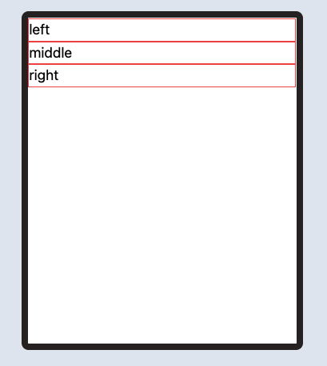
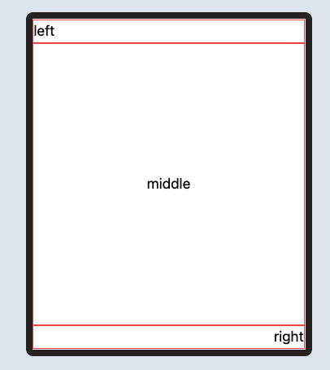

# Playing Card Project

In this project, we'll be creating playing cards. The finished product will look something like this:


## Phase 1

In this initial phase, we'll create a blank card. Watch the video walkthrough for this phase before coding it on your own.

[🎥 Phase 1 Walkthrough](https://vimeo.com/manage/videos/688246628)

### Starter code

Start by creating our document. Create `index.html` and paste the following starter code:

```html
<!DOCTYPE html>
  <html>
  <head>
    <meta charset="utf-8" />
    <meta name="viewport" content="width=device-width, initial-scale=1.0" />
    <script src="https://cdn.tailwindcss.com"></script>
    <script src="https://kit.fontawesome.com/638d441c12.js" crossorigin="anonymous"></script>
    <link rel="preconnect" href="https://fonts.googleapis.com">
    <link rel="preconnect" href="https://fonts.gstatic.com" crossorigin>
    <link href="https://fonts.googleapis.com/css2?family=Aldrich&display=swap" rel="stylesheet">
    <title>playing cards</title>
    <script>
    tailwind.config = {
      theme: {
        extend: {
          fontFamily: {
            aldrich: 'Aldrich, sans-serif',
          }
        },
      },
    };
    </script>
  </head>
  <body>
    let's play cards
  </body>
</html>
```

Don't be overwhelmed by the starter code! The starter code includes configuration for the fonts and icons that we will use in this project. Like you'd expect, you'll be writing all your code in the `<body>` tags. Run the page to check that everything is set up. You should see `"let's play cards"` in the browser.

> Check In: Make sure you can see "let's play cards" before continuing. Ask a teaching assistant for help if you are stuck.


### Creating a blank card


Let's start simple. Our goal is to create a single rectangle in the center of the screen. Delete the `"let's play cards"` text in the body and create a `div`. Be sure to include the opening and closing tags for this `div`! This initial `div` will be the outer container that takes up the full screen (it's the light blue shaded part in the [final product](#playing-card-project)). You can use class `h-screen` to make the `div` take up the full height of the screen. Use a color class to give it background color. We used `bg-slate-200` for our background color, but you can use another [color that you like](https://tailwindcss.com/docs/customizing-colors#default-color-palette).

Now time to make a simple card. No tricks here. We just want a rectangle that is more tall than it is wide. Create a new `div` that will represent our card. You should place it within the background div that you made just previously. Set the width and height using classes `w-80` and `h-96`. If you want different dimensions of your card, feel free to play around with different [widths](https://tailwindcss.com/docs/width#fixed-widths) and [heights](https://tailwindcss.com/docs/height#fixed-heights). Finally, apply a background color to the card div, we used `bg-white`.

Give your card a thick border with `border-8` and choose a dark [border color](https://tailwindcss.com/docs/border-color). We used `border-stone-800`. Finally, let's round those corners with `rounded-lg`. If you want sharper corners, play with other [rounded styles](https://tailwindcss.com/docs/border-radius#rounded-corners).


### Centering the card

To center the card, we'll want to add classes to it's parent `div`. We should add the class `flex` to the background `div`. Then add `justify-center` to center it horizontally. Add `items-center` to center it vertically. Done.

> Check In: Make sure your card is centered in the screen before moving on. Ask a teaching assistant for help if you are stuck.


## Phase 2

In this phase, we'll decorate the card to look like a real playing card. Watch the walkthrough for this phase before coding it on your own.

[🎥 Phase 2 Walkthrough](https://vimeo.com/manage/videos/688245878)

### Stubbing the 3 sections

Like we saw in the approach video, we can conceptualize a playing card as having three rows:

1. the top row containing a letter to the left
2. the middle row containing a picture in the middle
3. the bottom row containing a letter to the right

Create three `div`s to represent these rows inside of your card. Give them each a temporary border so you can see where they lie. Put some placeholder text in each div, so can play with the alignment:



Let's work on the horizontal alignment of the text. Give each of the 3 `div`s the `flex` class. The left text is already good. But the middle and right texts need some work. Recall that `justify-center` will position horizontally. `justify-end` will position all the way to the right.  

We are in good shape, but the divs all stack at the top. We want the 3rd div to be at the very bottom though. To accomplish this, we can force the 2nd `div` to take up as much space as possible. Because we want the 2nd `div` to take up more space relative to it's siblings, we need to make the parent `flex flex-col` and apply `flex-1` to the middle child. Be sure to use `flex-col` because we want to still stack the `div`s vertically in a column.

At this point your middle text may not be centered vertically in its `div`, use `items-center` to fix it. You'll want it to look like this:



> Check In: Make sure that your card looks similar. Ask a teaching assistant for help if you are stuck.

### Adding style

Now for all the details. Start by replacing the placeholder values. We'll make our card an ace, 'A', but you can choose whatever you like. Use `font-aldrich` to get a card-looking font. Apply a [text-color](https://tailwindcss.com/docs/text-color) that you like. You'll also want a larger [text-size](https://tailwindcss.com/docs/font-size).

Apply some [padding](https://tailwindcss.com/docs/padding) on the corner letters so they look nicely positioned. There's not much science to this tuning, just try different padding values and see what looks good.

Finally let's add a nice icon to the middle, we chose a diamond, but you can search for other [icons](https://fontawesome.com/icons/diamond?s=solid) that you like. Be sure to clean up the temporary borders:


Nice! Add a few more cards with different colors/values. Once you have more than one card, you'll notice that the cards are touching. We'd probably want some space between them for a clean look. You can fix this by modifying a `justify-?` property somewhere; we'll leave that detail for you to figure out. 

Voila! A hand of cards. Magic tricks not included.
