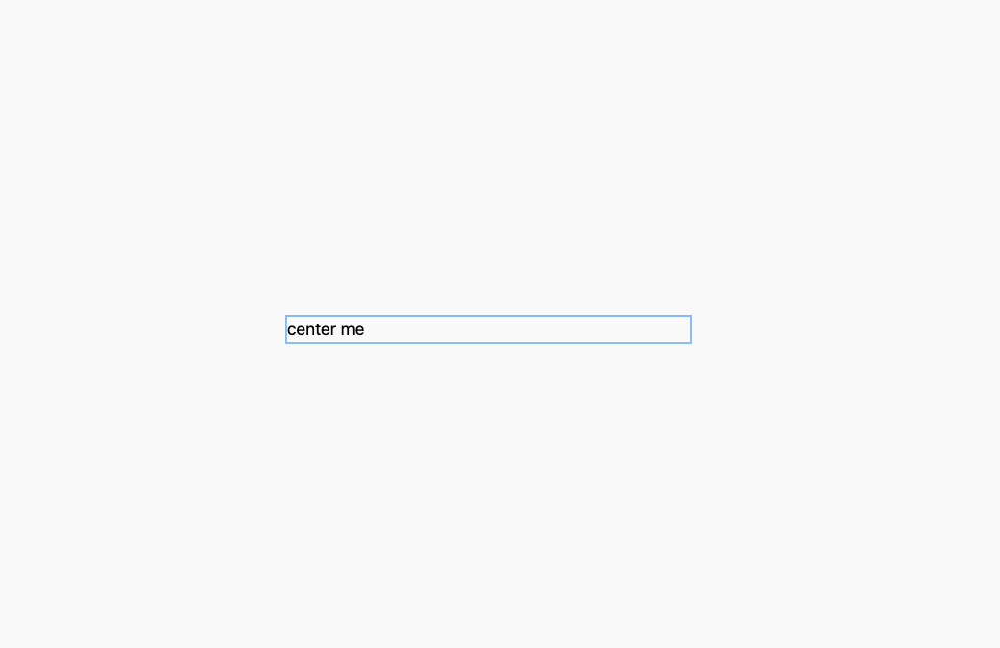
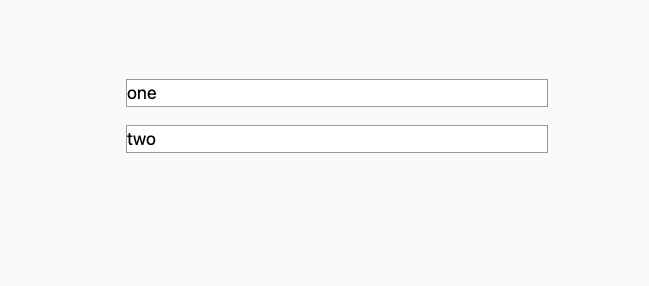
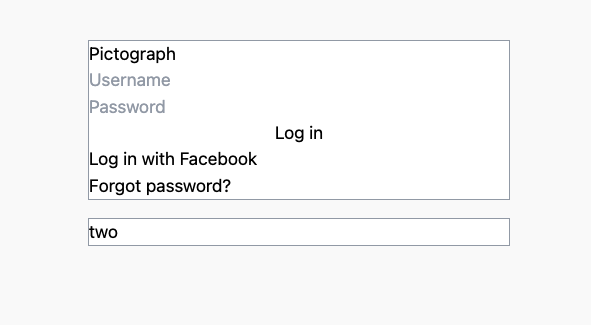
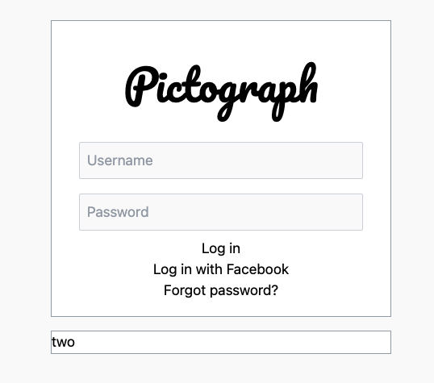
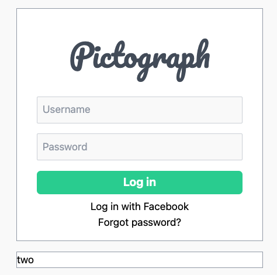

# Sign In Project

In this project, we'll be creating a sign in form in the style of Instagram. The final product will look something like this:


## Phase 1

We'll start by establishing two rectangles, centered in the page. 

### Starter code

Create a `index.html` and begin with this starter code:

```html
<!DOCTYPE html>
<html>
  <head>
    <meta charset="utf-8" />
    <meta name="viewport" content="width=device-width, initial-scale=1.0" />
    <script src="https://cdn.tailwindcss.com"></script>
    <script src="https://kit.fontawesome.com/638d441c12.js" crossorigin="anonymous"></script>
    <link rel="preconnect" href="https://fonts.googleapis.com">
    <link rel="preconnect" href="https://fonts.gstatic.com" crossorigin>
		<link href="https://fonts.googleapis.com/css2?family=Catamaran&family=Pacifico&display=swap" rel="stylesheet">
    <title>sign in</title>
    <script>
      tailwind.config = {
        theme: {
          extend: {
            fontFamily: {
							pacifico: 'Pacifico, cursive'
            }
          },
        },
      };
    </script>
  </head>
  <body>
		let's build a sign-in
  </body>
</html>
```

Start by creating a `div` that will act as the containing background for our eventual sign in form. Like usual, we'll making it `h-screen` so that it takes up the full screen height. Apply a [background color](https://tailwindcss.com/docs/background-color) to this div. Choose an off-white shade for the background; this will help the pure-white sign in card visually pop once we add it. We used `bg-zinc-50`. If you are having a hard time verifying if the `div` is the correct height, apply a temporary border to it so you can see where it lies.

Now we'll want to place one `div` in the center of the screen. Make the `div` have `w-96` to set the width. Give this `div` a temporary border and some temporary text so you can see it. Recall that to center this child `div` we can make parent (the background div) have `flex justify-center items-center`. This new `div` will be the container for the two boxes that make up two sections of the form. By making the parent container have a fixed width, it will ensure that the two child boxes are always the same width as their parent.

So far your page should look like:




### Adding the two boxes

Remove the placeholder text and put two `div`s inside of the centered div. Give them each a thin gray border with `border border-gray-400`. Also make them pop off the page with a white background `bg-white`. You may want some temporary text in both of these `div`s to see them for now.

We want some space between these white `div`s, so add a little vertical margin with `my-4` for both. Once you remove the temporary border around the parent, you'll have something like this:




> Check In: Make sure that your two boxes are centered and have some space between them like this before moving on. Ask a TA for help if you are stuck!


## Phase 2

In this phase, we'll begin to add all of the content to each of the boxes. See the completed product image at the top of this reading for what content we'll need to plan for.

### Adding content

Let's start by adding the title, two `input`s, and a `button` to the first box. Choose your own catchy title for this make-believe application, we chose "Pictograph".

Recall that an `input` is made with:

```html
  <input placeholder="Username" />
```

Recall that a `button` is made with:

```html
  <button>Log in</button>
```

After adding these things, you may notice that some of the elements are sharing lines. Make the box have `flex flex-col` to ensure that all things stack vertically.

In the first box, also add `div`s for the "Log in with Facebook" and "Forgot password?" messages.

It won't look pretty for now but the skeleton of our form will look similar to this:



### Adding style to the title and inputs

Let's start adding style! Right now, most content is to the left. For the first box, give it `items-center` to center all content. Recall that in a `flex-col`, `items-center` will center horizontally. Add some padding like `p-4` to the box that so the content doesn't touch the border:


We included the font `font-pacifico` for you to use for the title. Apply that to your title and make it larger with a nice [text-size](https://tailwindcss.com/docs/font-size), maybe `text-5xl`or similar. If you want to leave some space around the title, use [margin](https://tailwindcss.com/docs/margin) like `m-8`.

For the `input`s give them a slight rounded border with `border border-gray-300 rounded-sm`. You can also give them an off-white background ,`bg-zinc-50`, so they contrast with the card. Adjust the [width](https://tailwindcss.com/docs/width#fixed-widths) of the inputs. Also add some tasteful [margin](https://tailwindcss.com/docs/margin) around them so we can have space between the inputs. Adding some [padding](https://tailwindcss.com/docs/padding) will allow you to increase the space inside an input, moving the text of the input farther away from it's border. We'll leave it to you to play with these values:



### Adding style to the button

Let's improve the button. Make the button the same width `w-?` as the inputs. We want you to design the rest of this one. To start, consider modifying the button's [background color](https://tailwindcss.com/docs/background-color) and [corners](https://tailwindcss.com/docs/border-radius#rounded-corners). There are some other properties you'll want to modify, but that's for you to discover. We think this is a decent looking button, can you make yours similar?



### Styling the rest

Now we just need to style the rest of the text. Play with  the [text-size](https://tailwindcss.com/docs/font-size) and [text-color](https://tailwindcss.com/docs/text-color) of the different parts. Be sure to use healthy [margin](https://tailwindcss.com/docs/margin) to space out the sentences. Pick a [Facebook icon](https://fontawesome.com/search?q=facebook) that you like as well. We'll leave it to you. Can you make style your form similar to this?


Hint: Wondering how we made the "Sign Up" text green in second box? The "Sign Up" text is actually inside of it's own `span` that we can apply classes to:

```html
<div>
  Don't have an account? <span class="text-emerald-600">Sign Up</span>
</div>
```

Congrats! You've made your first form.


